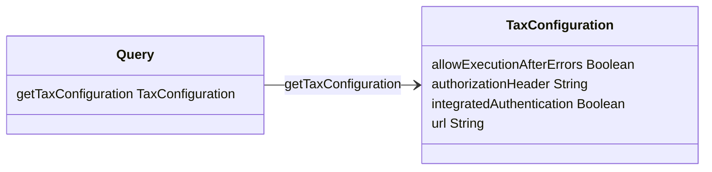
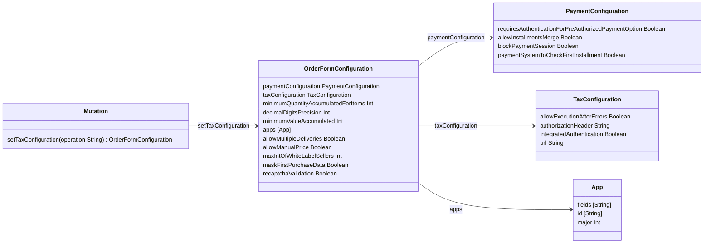

# Tax Protocol GraphQL API

This API enables setting and retrieving the Tax Configuration, which is part of the [OrderForm configuration](https://developers.vtex.com/docs/guides/get-an-account-orderform-configuration), for the Tax Service.

## Schema overview

### Query

<table>
  <thead>
    <tr>
      <th align="left">Field</th>
      <th align="right">Argument</th>
      <th align="left">Type</th>
      <th align="left">Description</th>
    </tr>
  </thead>
  <tbody>
    <tr>
      <td colspan="2" valign="top">
        <strong id="query.gettaxconfiguration">getTaxConfiguration</strong>
      </td>
      <td valign="top"><a href="#taxconfiguration">TaxConfiguration</a></td>
      <td>Retrieves the tax configuration for an account from the orderForm using the Checkout API (<a href="https://developers.vtex.com/docs/api-reference/checkout-api#get-/api/checkout/pvt/configuration/orderForm" target="_blank">Get orderForm configuration</a>).</td>
    </tr>
  </tbody>
</table>

### Mutation

<table>
  <thead>
    <tr>
      <th align="left">Field</th>
      <th align="right">Argument</th>
      <th align="left">Type</th>
      <th align="left">Description</th>
    </tr>
  </thead>
  <tbody>
    <tr>
      <td colspan="2" valign="top">
        <strong id="mutation.settaxconfiguration">setTaxConfiguration</strong>
      </td>
      <td valign="top">
        <a href="#orderformconfiguration">OrderFormConfiguration</a>
      </td>
      <td>Activates or deactivates the tax service in the <a href="https://developers.vtex.com/docs/guides/update-an-account-orderform-configuration" target="_blank">orderForm configuration</a> using the (<a href="https://developers.vtex.com/docs/api-reference/checkout-api#post-/api/checkout/pvt/configuration/orderForm" target="_blank">Update orderForm configuration</a>) endpoint.</td>
    </tr>
    <tr>
      <td colspan="2" align="right" valign="top">operation</td>
      <td valign="top">String</td>
      <td>Argument to define whether the tax service will be activated or deactivated. Possible values: <code>"activate"</code>, <code>"deactivate"</code>.</td>
    </tr>
  </tbody>
</table>

## Schema description

>⚠️ Arguments must be provided by the user. Required fields are marked with an exclamation mark (`!`).

### OrderFormConfiguration

<table>
  <thead>
    <tr>
      <th align="left">Field</th>
      <th align="right">Argument</th>
      <th align="left">Type</th>
      <th align="left">Description</th>
    </tr>
  </thead>
  <tbody>
    <tr>
      <td colspan="2" valign="top">
        <strong id="orderformconfiguration.paymentconfiguration">paymentConfiguration</strong>
      </td>
      <td valign="top">
        <a href="#paymentconfiguration">PaymentConfiguration</a>
      </td>
      <td>Payment configuration information.</td>
    </tr>
    <tr>
      <td colspan="2" valign="top">
        <strong id="orderformconfiguration.taxconfiguration">taxConfiguration</strong>
      </td>
      <td valign="top">
        <a href="#taxconfiguration">TaxConfiguration</a>
      </td>
      <td>External tax service configuration information.</td>
    </tr>
    <tr>
      <td colspan="2" valign="top">
        <strong id="orderformconfiguration.minimumquantityaccumulatedforitems">
          minimumQuantityAccumulatedForItems</strong>
      </td>
      <td valign="top">
        Int
      </td>
      <td>Minimum SKU quantity by cart. This field is mandatory and must be sent in all requests.</td>
    </tr>
    <tr>
      <td colspan="2" valign="top">
        <strong id="orderformconfiguration.decimaldigitsprecision">decimalDigitsPrecision</strong>
      </td>
      <td valign="top">
        Int
      </td>
      <td>Number of price digits.</td>
    </tr>
    <tr>
      <td colspan="2" valign="top">
        <strong id="orderformconfiguration.minimumvalueaccumulated">minimumValueAccumulated</strong>
      </td>
      <td valign="top">
        Int
      </td>
      <td>Minimum cart value.</td>
    </tr>
    <tr>
      <td colspan="2" valign="top">
        <strong id="orderformconfiguration.apps">apps</strong>
      </td>
      <td valign="top">[<a href="#app">App</a>]</td>
      <td>List of App objects, where each object has an app configuration information. See an example with the <code>apps</code> list in the <a href="https://developers.vtex.com/docs/guides/get-an-account-orderform-configuration" target="_blank">Get orderForm configuration</a> response body.</td>
    </tr>
    <tr>
      <td colspan="2" valign="top">
        <strong id="orderformconfiguration.allowmultipledeliveries">allowMultipleDeliveries</strong>
      </td>
      <td valign="top">
        Boolean
      </td>
      <td>Allows the selection of items from several delivery channels in the same purchase.</td>
    </tr>
    <tr>
      <td colspan="2" valign="top">
        <strong id="orderformconfiguration.allowmanualprice">allowManualPrice</strong>
      </td>
      <td valign="top">
        Boolean
      </td>
      <td>Allows the editing of SKU prices directly in the cart.</td>
    </tr>
    <tr>
      <td colspan="2" valign="top">
        <strong id="orderformconfiguration.maxintofwhitelabelsellers">maxIntOfWhiteLabelSellers</strong>
      </td>
      <td valign="top">
        Int
      </td>
      <td>Allows the input of a limit of white label sellers involved on the cart.</td>
    </tr>
    <tr>
      <td colspan="2" valign="top">
        <strong id="orderformconfiguration.maskfirstpurchasedata">maskFirstPurchaseData</strong>
      </td>
      <td valign="top">
        Boolean
      </td>
      <td>Allows, on a first purchase, masking client's data. It could be useful when a shared cart is used and the client doesn't want to share its data.</td>
    </tr>
    <tr>
      <td colspan="2" valign="top">
        <strong id="orderformconfiguration.recaptchavalidation">recaptchaValidation</strong>
      </td>
      <td valign="top">
        Boolean
      </td>
      <td>Configures reCAPTCHA validation status for the account.</td>
    </tr>
  </tbody>
</table>

<a href="#mutation">Mutation</a> 🔼

### App

<table>
  <thead>
    <tr>
      <th align="left">Field</th>
      <th align="right">Argument</th>
      <th align="left">Type</th>
      <th align="left">Description</th>
    </tr>
  </thead>
  <tbody>
    <tr>
      <td colspan="2" valign="top">
        <strong id="app.fields">fields</strong>
      </td>
      <td valign="top">[String]</td>
      <td>List of fields available to the app.</td>
    </tr>
    <tr>
      <td colspan="2" valign="top">
        <strong id="app.id">id</strong>
      </td>
      <td valign="top">String</td>
      <td>App ID.</td>
    </tr>
    <tr>
      <td colspan="2" valign="top">
        <strong id="app.major">major</strong>
      </td>
      <td valign="top">
        Int
      </td>
      <td>App major version.</td>
    </tr>
  </tbody>
</table>

<a href="#orderformconfiguration">OrderFormConfiguration</a> 🔼

### PaymentConfiguration

<table>
  <thead>
    <tr>
      <th align="left">Field</th>
      <th align="right">Argument</th>
      <th align="left">Type</th>
      <th align="left">Description</th>
    </tr>
  </thead>
  <tbody>
    <tr>
      <td colspan="2" valign="top">
        <strong id="paymentconfiguration.requiresauthenticationforpreauthorizedpaymentoption">
          requiresAuthenticationForPreAuthorizedPaymentOption</strong>
      </td>
      <td valign="top">
        Boolean
      </td>
      <td>Determines whether pre-authorized payments require authentication. This field is mandatory and must be sent in all requests.</td>
    </tr>
    <tr>
      <td colspan="2" valign="top">
        <strong id="paymentconfiguration.allowinstallmentsmerge">allowInstallmentsMerge</strong>
      </td>
      <td valign="top">
        Boolean
      </td>
      <td>By default (when <code>false</code>), on a multi-seller purchase is on the run, a simple intersection with installments options configured by every seller will be available. When <code>true</code>, this option allows a more complex but flexible installment option, since it considers max installments of every seller configuration, even if those don't match. Installment values ​​may not be equal in this case.</td>
    </tr>
    <tr>
      <td colspan="2" valign="top">
        <strong id="paymentconfiguration.blockpaymentsession">blockPaymentSession</strong>
      </td>
      <td valign="top">
        Boolean
      </td>
      <td>Indicates whether shoppers can add credit cards in your store's <a href="https://developers.vtex.com/docs/apps/vtex.my-account" target="_blank">My Account</a> section.</td>
    </tr>
    <tr>
      <td colspan="2" valign="top">
        <strong id="paymentconfiguration.paymentsystemtocheckfirstinstallment">
          paymentSystemToCheckFirstInstallment</strong>
      </td>
      <td valign="top">
        Boolean
      </td>
      <td>If you want to apply a first installment discount to a particular payment system, set this field to that payment system's ID. Learn more: <a href="https://help.vtex.com/en/tutorial/configuring-a-discount-for-orders-prepaid-in-full--7Lfcj9Wb5dpYfA2gKkACIt" target="_blank">Configuring a discount for orders prepaid in full</a>.</td>
    </tr>
  </tbody>
</table>

<a href="#orderformconfiguration">OrderFormConfiguration</a> 🔼

### TaxConfiguration

<table>
  <thead>
    <tr>
      <th align="left">Field</th>
      <th align="left">Type</th>
      <th align="left">Description</th>
    </tr>
  </thead>
  <tbody>
    <tr>
      <td valign="top">
        <strong id="taxconfiguration.allowexecutionaftererrors">allowExecutionAfterErrors</strong>
      </td>
      <td valign="top">
        Boolean
      </td>
      <td>Allows continuing with the purchase even on a tax system problem occurrence.</td>
    </tr>
    <tr>
      <td valign="top">
        <strong id="taxconfiguration.authorizationheader">authorizationHeader</strong>
      </td>
      <td valign="top">
        String
      </td>
      <td>String that the Checkout will use in the <code>Authorization</code> header of calls to the external tax calculation API. This field can be used to define the access credentials for this API. Example: <code>"99b9935b048dfd86893d0bf9gas628849"</code>.</td>
    </tr>
    <tr>
      <td valign="top">
        <strong id="taxconfiguration.integratedauthentication">integratedAuthentication</strong>
      </td>
      <td valign="top">
        Boolean
      </td>
      <td>When <code>true</code>, tax system uses <a href="https://developers.vtex.com/docs/guides/authentication" target="_blank">VTEX auth</a>. When <code>false</code>, use <code>authorizationHeader</code> instead.</td>
    </tr>
    <tr>
      <td valign="top">
        <strong id="taxconfiguration.url">url</strong>
      </td>
      <td valign="top">
        String
      </td>
      <td>String of external API endpoint of the tax provider that the Checkout will query to receive the calculated taxes. Example: <code>"https://sandbox-rest.avatax.com/api/v2/transactions/create"</code>.</td>
    </tr>
  </tbody>
</table>

<a href="#query">Query</a> 🔼

<a href="#orderformconfiguration">OrderFormConfiguration</a> 🔼

